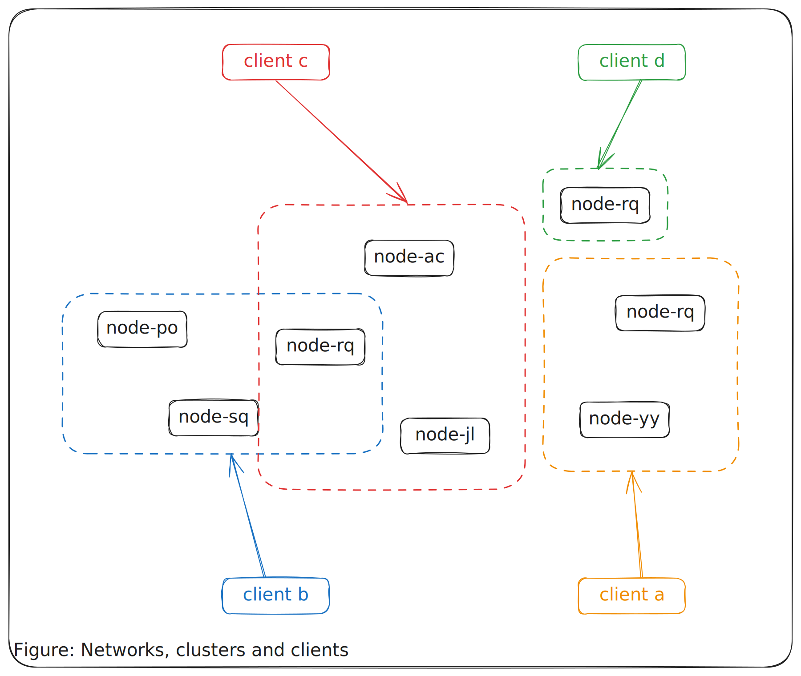
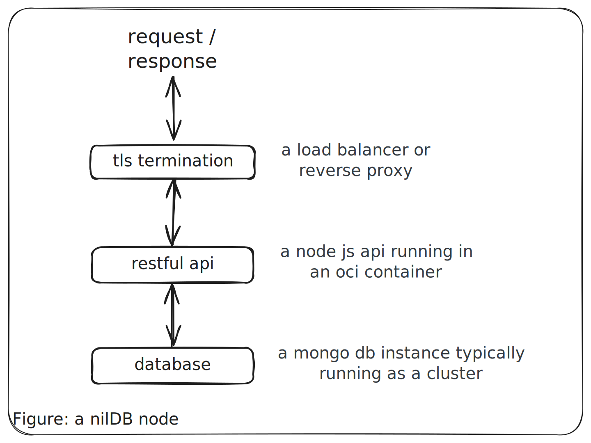

# An overview

nilDb is a structured data persistence service that provides a robust, distributed, and queryable data solution when multiple nodes are combined into a cluster. Users write data schemas, upload those schemas to nilDB clusters, and then perform data CRUD operations against them. Additionally, users can write aggregation pipelines to produce insights from their data. Users can apply advanced cryptography to enable secret sharing and other secure data processing use cases.

## Contents

- [Networks](#networks)
- [Network topology](#network-topology)
    - [Clusters](#clusters)
    - [Node Architecture](#node-architecture)
- [Clients](#clients)

## Networks

There are two nilDB networks:

1. _Mainnet_ refers to the group of nodes integrated with nilChain mainnet (not yet launched).
2. _Devnet_ refers to the group of nodes integrated with nilChain testnet.

## Network topology

### Clusters

A nilDB cluster is a subset of nodes within a network. Cluster membership is defined by the client, allowing multiple clusters to exist within a network.

<div style="text-align: center">
  
</div>

### Node architecture

Each nilDB node consists of a RESTful API and a database:

<div style="text-align: center">
  
</div>

Deployment typically includes:

- TLS termination via cloud provider (AWS, GCP) or reverse proxy (e.g., Caddy)
- Database (local or hosted MongoDB Atlas)
- API container running in a container runtime (e.g., Docker)

### Clients

nilDB uses a decentralized authentication model based on secp256k1 key pairs. Clients:

1. Generate their own identities using secp256k1 private keys
2. Derive public keys and DIDs ([Decentralised Identifier](https://www.w3.org/groups/wg/did/))
3. Register with cluster nodes
4. Create ES256K JWTs for authentication

As RESTful APIs any modern HTTP client can be used to interact with a nilDB. Clients generate their own identities based on a secp256k1 private key. The derived public key and  are then used to register with nodes in the cluster and create authentication tokens.

> ![INFO]
> Unlike traditional web2 systems where authentication is centrally controlled, nilDB clients generate and manage their own JWT tokens without central authority.

Example API interaction:

```shell
curl https://nildb-a50d.nillion.network/api/v1/data/create \
  --header "Bearer ${TOKEN}" \
  --header "Content-type: application/json" \
  -d @data.json
```

> ![INFO] Data encryption is applied using [nilQL-ts](github.com/nillionnetwork/nilql-ts) or [nilQL-py](https://github.com/nillionnetwork/nilql-py) before transmission. 
